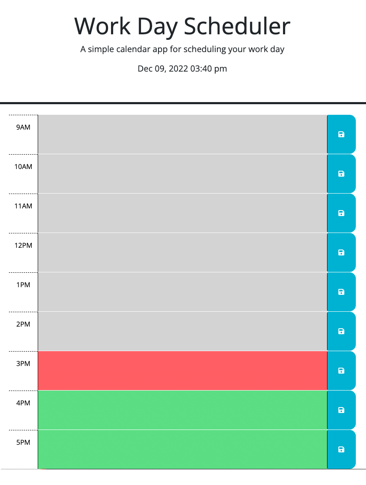

# work-day-scheduler
A calendar that allows you to save events for each hour of the day.

## Description

This is an online daily work day scheduler that allows the user to set appointments and save them to the schedule. The project was created so a user can keep track of appointments by the hour each day. It provides a tool fpr organizing your work day. Building the program allowed me to apply various Javascript features, like utilizing local storage and DayJS.

## Installation

N/A

## Usage

On page load, fill in events, appointements or to-do's for each hour of the day. After you enter data into an hour, click the save icon (disc) on the right in the blue tab. By saving the entered data will stay present until deleted by the user, even if the page is left and returned to or refreshed. The colors for each hour change based on the current hour of the day. All hours shown in grey have passed, the hour shown in red is the current hour and the hours shown in green are in the furure. See screen capture for visual.

## Credits

Special thanks to Bryan Swarthout, who gave me the instruction to complete the project.

## License

(MIT) Please refer to the license in the Repo.
